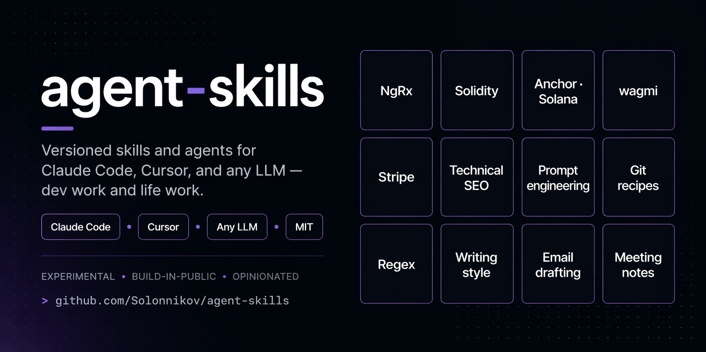

# agent-skills



[](https://github.com/Solonnikov/agent-skills/releases)
[](#license)

A public, experimental collection of **agent skills** and **role agents** for AI coding tools — Claude Code, Cursor, Codex, Copilot, Aider, or any LLM you paste context into. General-purpose roles alongside specialized material in areas I work in daily: frontend (Angular, NgRx) and Web3 (wallet integrations, smart contract interaction, payments).

Work in progress. Use as starting material; verify what you adopt.

## Install

One command pulls everything into your tool's agents/skills folder.

**Claude Code (user-wide):**
```bash
curl -fsSL https://raw.githubusercontent.com/Solonnikov/agent-skills/main/install.sh | bash
```

**Other targets** (run the installer with flags):
```bash
git clone https://github.com/Solonnikov/agent-skills.git
cd agent-skills
./install.sh --target cursor              # .cursor/rules/ in the current dir
./install.sh --target copy --dest ./foo   # plain copy to a path
./install.sh --agents-only
./install.sh --skills-only
./install.sh --help
```

Default mode is **symlink from a clone** (so `git pull` updates your local copy) and **copy when curl-piped**.

**Any other AI / LLM:** the content is plain Markdown. Open any file, paste into your tool's system prompt, context, or rules section.

## What's here

```
agent-skills/
├── install.sh
├── agents/
│   └── software-development/     # generic role agents (no framework lock-in)
└── skills/                       # reusable how-to skills, one folder each
    ├── agent-skill-creator/
    ├── content-repurposing/
    ├── email-drafting/
    ├── evm-contract-scaffold/
    ├── git-workflow-recipes/
    ├── hardhat-etherscan-verification/
    ├── meeting-notes-structure/
    ├── ngrx-feature-scaffold/
    ├── prompt-engineering-patterns/
    ├── regex-cookbook/
    ├── research-brief-structure/
    ├── resume-tailor/
    ├── reown-appkit-web3/
    ├── solana-program-scaffold/
    ├── stripe-subscription-lifecycle/
    ├── technical-seo-checklist/
    ├── wagmi-contract-interaction/
    └── writing-style-editor/
```

**Skills** — procedures, patterns, templates, and checklists an agent loads on demand. Each skill is a folder with a tight `SKILL.md` and long-form `references/`.

**Agents** — role-style Markdown definitions (who is responsible for what, how they decide, how they hand off). Generic by design; framework-specific knowledge lives in skills, not in agent descriptions.

### Skills

| Skill | Category | Purpose |
|-------|----------|---------|
| [agent-skill-creator](./skills/agent-skill-creator/SKILL.md) | Meta | Authoring new skills in this repo's format. |
| [git-workflow-recipes](./skills/git-workflow-recipes/SKILL.md) | Everyday dev | Recipes for undoing, rebasing, resolving conflicts, rescuing lost work, PR cleanup. |
| [regex-cookbook](./skills/regex-cookbook/SKILL.md) | Everyday dev | Copy-ready regex patterns, building blocks, language differences, debugging. |
| [prompt-engineering-patterns](./skills/prompt-engineering-patterns/SKILL.md) | AI / LLM | Production prompt patterns — roles, few-shot, CoT, structured output, caching, evaluation. |
| [ngrx-feature-scaffold](./skills/ngrx-feature-scaffold/SKILL.md) | Angular | Scaffold a complete NgRx feature (actions, reducer, effects, selectors, facade, tests). |
| [technical-seo-checklist](./skills/technical-seo-checklist/SKILL.md) | Web / SEO | Metadata, structured data, crawlability, Core Web Vitals, international targeting. |
| [evm-contract-scaffold](./skills/evm-contract-scaffold/SKILL.md) | Web3 (EVM) | Bootstrap a Solidity project — Foundry-first, OpenZeppelin patterns, testing, deployment. |
| [hardhat-etherscan-verification](./skills/hardhat-etherscan-verification/SKILL.md) | Web3 (EVM) | Verify deployed contracts — plugin path + manual V2 API fallback. |
| [reown-appkit-web3](./skills/reown-appkit-web3/SKILL.md) | Web3 | Integrate `@reown/appkit` multi-chain wallets (EVM, Solana, Bitcoin). |
| [solana-program-scaffold](./skills/solana-program-scaffold/SKILL.md) | Web3 (Solana) | Anchor program scaffold — PDAs, SOL/SPL variants, constraint validation, testing. |
| [wagmi-contract-interaction](./skills/wagmi-contract-interaction/SKILL.md) | Web3 (EVM) | Read, write, and watch EVM smart contracts with wagmi v2. |
| [stripe-subscription-lifecycle](./skills/stripe-subscription-lifecycle/SKILL.md) | Backend / Payments | Stripe subscriptions end-to-end — webhook-driven state sync, cancellation, tier downgrades, testing. |
| [writing-style-editor](./skills/writing-style-editor/SKILL.md) | Writing / Life | Tighten prose — cut fluff, vary sentence length, strengthen verbs, match a voice. |
| [email-drafting](./skills/email-drafting/SKILL.md) | Writing / Life | Draft emails in the right tone — cold, follow-up, apology, decline, feedback. |
| [meeting-notes-structure](./skills/meeting-notes-structure/SKILL.md) | Writing / Life | Notes that capture decisions and action items — templates for standups, 1-on-1s, retros, planning. |
| [resume-tailor](./skills/resume-tailor/SKILL.md) | Writing / Life | Tailor a résumé to a JD — parse, rewrite bullets, quantify, pass ATS. |
| [content-repurposing](./skills/content-repurposing/SKILL.md) | Writing / Life | One piece of content across multiple platforms — blog → thread → LinkedIn → newsletter. |
| [research-brief-structure](./skills/research-brief-structure/SKILL.md) | Writing / Life | Briefs that answer a question — sources, synthesis, recommendation, gaps. |

### Agents

[`agents/software-development/`](./agents/software-development) — `frontend-developer`, `backend-developer`, `test-engineer`, `code-reviewer`, `security-reviewer`, `ui-reviewer`, `web3-auditor`, `product-manager`, `devops-engineer`, `technical-writer`, `solution-architect`.

## Tool compatibility

| Tool | How the repo drops in |
|------|------------------------|
| **Claude Code** | `./install.sh` — files go to `~/.claude/agents/` and `~/.claude/skills/`. Agents with YAML frontmatter are directly invocable. |
| **Cursor** | `./install.sh --target cursor` — files go to `./.cursor/rules/`. Rename to `.mdc` and adjust frontmatter per Cursor docs if needed. |
| **Codex / Copilot / Aider / Continue** | `./install.sh --target copy --dest <your-tool's-path>`, or copy the Markdown content into your tool's context/rules/prompt field. |
| **Any other LLM** | Open the file in GitHub, copy the Markdown, paste into your system prompt or context. |

Content is written in plain Markdown so every tool that reads text can use it.

## Contributing

Pull requests and ideas welcome. See [`CONTRIBUTING.md`](./CONTRIBUTING.md) for the full working flow — branch conventions, PR workflow, skill authoring steps, release rules, semver cadence, and commit/PR-title conventions.

Quick summary:
- `main` is protected — every change goes through a PR.
- New skill → follow the format in [`agent-skill-creator`](./skills/agent-skill-creator/SKILL.md).
- Patch for fixes, minor for a new skill/agent, major for breaking changes.
- Clean PR titles → clean auto-generated release notes.

## Disclaimer

Most of the content here is AI-generated or produced with significant AI assistance, then reviewed and edited. It is not a guarantee of accuracy, completeness, or fit for your use case — treat it like any other generated material and verify what you adopt.

These skills and agents are **experimental**. Their behavior and side effects are not fully characterized. Content may be wrong for your situation or unsafe without human review (running commands, changing files, applying security-related guidance). This is not legal, financial, or professional advice.

**Do not use or apply this material on systems you do not own or are not authorised to change.** Use at your own risk.

## License

MIT. Individual skills or agents may state otherwise; check the file if in doubt.
